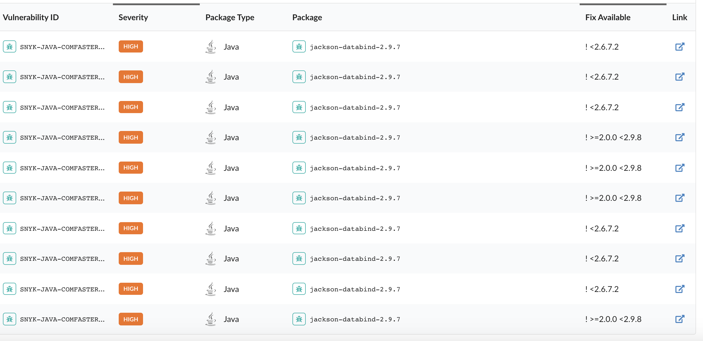
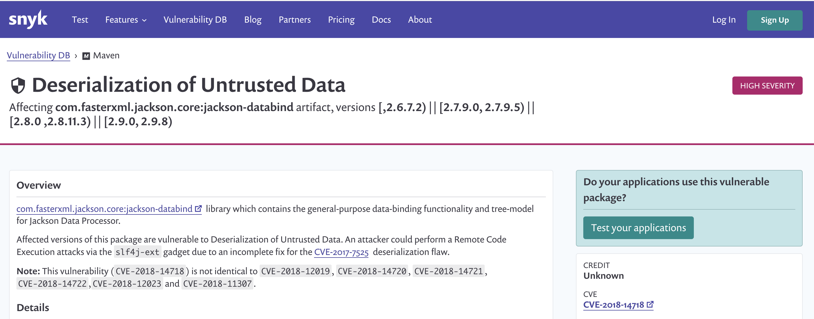
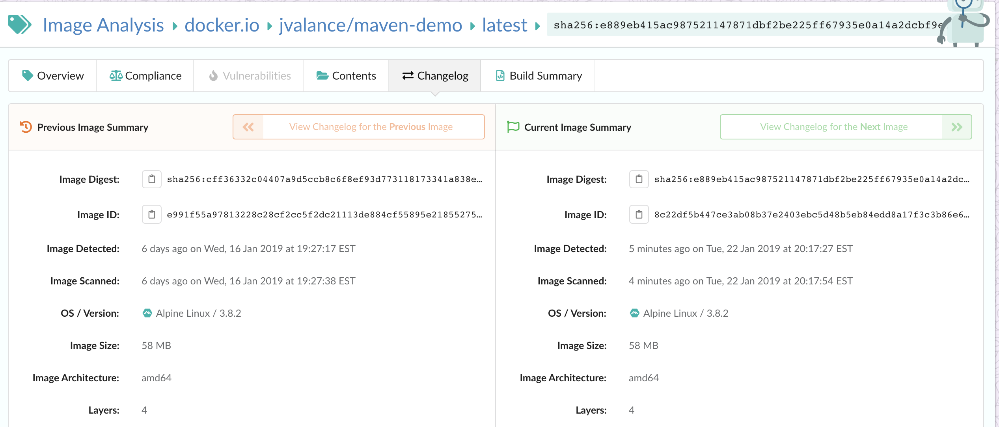

# Identifying vulnerabilities with Anchore

## Introduction

By far one the most common challenges Anchore helps it's users solve is the identification of vulnerabilities within their Docker container images. Anchore analysis tools will inspect container images and generate a detailed manifest of the image, a virtual 'bill of materials' that includes official operating system packages, unofficial packages, configuration files, and language modules and artifacts. Following this, Anchore will evaluate policies against the analysis result, which includes vulnerability matches on the artifacts discovered in the image.

Quite often, Docker images contain both application and operating system packages. However, in this particular post, I will focus on the identification of a specific vulnerable application package inside an image, walkthrough how it can be visualized within the [Anchore Enteprise UI](https://anchore.com/enterprise), and what might an approach be to remediate.

As part of Anchore Enterprise, the vulnerability data source you will be seeing comes from Snyk. I recently wrote a post discussing the choice at Anchore to add this high quality vulnerability data source to our enterprise platform which you can read about [here](https://anchore.com/blog/improving-open-source-security-with-anchore-snyk/).

## Sample project repo

I will be referencing this example Github repositiory located [here](https://github.com/valancej/vulnerability-demos). The idea is simple, create a war file with Maven containing a vulnerable library, create a Docker image containing the war file, scan it with Anchore, and see what vulnerabilities as present. It is not the intent to run this Java project or anything outside of the scope discussed above. 

## Viewing the dependecies

When viewing the `pom.xml` file for this project I can clearly see which dependencies I will be including.

Dependencies section of `pom.xml`:

```
  <dependencies>
    <dependency>
      <groupId>junit</groupId>
      <artifactId>junit</artifactId>
      <version>4.11</version>
    </dependency>
    <dependency>
      <groupId>com.fasterxml.jackson.core</groupId>
      <artifactId>jackson-databind</artifactId>
      <version>${jackson.version}</version>
    </dependency>
  </dependencies>
```

The vulnerable artifact I've added to this particular project can be found on Maven Central [here](https://mvnrepository.com/artifact/com.fasterxml.jackson.core/jackson-databind/2.9.7).

## Building project

### Viewing the dependency tree

Since we are leveraging Maven to build this project, I can also use a Maven command to view the dependencies. The command `mvn dependency:tree` will display the depedency tree for this project as seen below.

```
mvn dependency:tree
[INFO] Scanning for projects...
[INFO] 
[INFO] ------------------------< Anchore:anchore-demo >------------------------
[INFO] Building Anchore Demo 1.0
[INFO] --------------------------------[ war ]---------------------------------
[INFO] 
[INFO] --- maven-dependency-plugin:2.8:tree (default-cli) @ anchore-demo ---
[INFO] Anchore:anchore-demo:war:1.0
[INFO] +- junit:junit:jar:4.11:compile
[INFO] |  \- org.hamcrest:hamcrest-core:jar:1.3:compile
[INFO] \- com.fasterxml.jackson.core:jackson-databind:jar:2.9.7:compile
[INFO]    +- com.fasterxml.jackson.core:jackson-annotations:jar:2.9.0:compile
[INFO]    \- com.fasterxml.jackson.core:jackson-core:jar:2.9.7:compile
[INFO] ------------------------------------------------------------------------
[INFO] BUILD SUCCESS
[INFO] ------------------------------------------------------------------------
[INFO] Total time:  1.117 s
[INFO] Finished at: 2019-01-22T19:39:56-05:00
[INFO] ------------------------------------------------------------------------
```

### Building war file

To create the war file as defined in the `pom.xml` I will run the command `mvn clean package`. The important piece here is that `package` will generate the war file and place it in the target directory as seen below.

```
target jvalance$ ls -la | grep anchore-demo-1.0.war
-rw-r--r--   1 jvalance  staff  1862404 Jan 22 19:50 anchore-demo-1.0.war
```

## Building and scanning Docker image

For the purposes of this post, I just need to include the war file created in the previous step in our Docker image. A simple way to do this can be defined below in a Dockerfile.

```
FROM openjdk:8-jre-alpine

# Copy target directory
COPY target/ app/
```

Once I've built the image and pushed it to a container registry, I can now scan it with Anchore via the CLI command below.

`anchore-cli image add docker.io/jvalance/maven-demo:latest`

## Viewing vulnerabilities

Once Anchore has completed analysis of the image successfully, I can check for non-os vulnerabilities via the following CLI command:

```
anchore-cli image vuln docker.io/jvalance/maven-demo:latest non-os

## The above produces the following output:

Vulnerability ID                               Package                       Severity        Fix                     Vulnerability URL                                                   
SNYK-JAVA-COMFASTERXMLJACKSONCORE-72448        jackson-databind-2.9.7        High            ! <2.6.7.2              https://snyk.io/vuln/SNYK-JAVA-COMFASTERXMLJACKSONCORE-72448        
SNYK-JAVA-COMFASTERXMLJACKSONCORE-72448        jackson-databind-2.9.7        High            ! <2.6.7.2              https://snyk.io/vuln/SNYK-JAVA-COMFASTERXMLJACKSONCORE-72448        
SNYK-JAVA-COMFASTERXMLJACKSONCORE-72449        jackson-databind-2.9.7        High            ! <2.6.7.2              https://snyk.io/vuln/SNYK-JAVA-COMFASTERXMLJACKSONCORE-72449        
SNYK-JAVA-COMFASTERXMLJACKSONCORE-72449        jackson-databind-2.9.7        High            ! <2.6.7.2              https://snyk.io/vuln/SNYK-JAVA-COMFASTERXMLJACKSONCORE-72449        
SNYK-JAVA-COMFASTERXMLJACKSONCORE-72451        jackson-databind-2.9.7        High            ! <2.6.7.2              https://snyk.io/vuln/SNYK-JAVA-COMFASTERXMLJACKSONCORE-72451        
SNYK-JAVA-COMFASTERXMLJACKSONCORE-72451        jackson-databind-2.9.7        High            ! <2.6.7.2              https://snyk.io/vuln/SNYK-JAVA-COMFASTERXMLJACKSONCORE-72451        
SNYK-JAVA-COMFASTERXMLJACKSONCORE-72882        jackson-databind-2.9.7        High            ! >=2.0.0 <2.9.8        https://snyk.io/vuln/SNYK-JAVA-COMFASTERXMLJACKSONCORE-72882        
SNYK-JAVA-COMFASTERXMLJACKSONCORE-72882        jackson-databind-2.9.7        High            ! >=2.0.0 <2.9.8        https://snyk.io/vuln/SNYK-JAVA-COMFASTERXMLJACKSONCORE-72882        
SNYK-JAVA-COMFASTERXMLJACKSONCORE-72883        jackson-databind-2.9.7        High            ! >=2.0.0 <2.9.8        https://snyk.io/vuln/SNYK-JAVA-COMFASTERXMLJACKSONCORE-72883        
SNYK-JAVA-COMFASTERXMLJACKSONCORE-72883        jackson-databind-2.9.7        High            ! >=2.0.0 <2.9.8        https://snyk.io/vuln/SNYK-JAVA-COMFASTERXMLJACKSONCORE-72883        
SNYK-JAVA-COMFASTERXMLJACKSONCORE-72884        jackson-databind-2.9.7        High            ! >=2.0.0 <2.9.8        https://snyk.io/vuln/SNYK-JAVA-COMFASTERXMLJACKSONCORE-72884        
SNYK-JAVA-COMFASTERXMLJACKSONCORE-72884        jackson-databind-2.9.7        High            ! >=2.0.0 <2.9.8        https://snyk.io/vuln/SNYK-JAVA-COMFASTERXMLJACKSONCORE-72884 
```

I also have the option to login and view the vulnerabilities via the UI.



By clicking on any of the links on the far right, I can immediately be taken to Snyk's Vulnerablity DB to view more information. Example: [SNYK-JAVA-COMFASTERXMLJACKSONCORE-72448](https://snyk.io/vuln/SNYK-JAVA-COMFASTERXMLJACKSONCORE-72448).



For this particular vulnerability, Snyk offers remediation advice located at the bottom. Which states: "Upgrade com.fasterxml.jackson.core:jackson-databind to version 2.6.7.2, 2.7.9.5, 2.8.11.3, 2.9.8 or higher."

Given that there are twelve known vulnerabilites found within this image, it is a best practice for a security team to go through each and make a decision with the developer how to best triage. For the simplicity of this post, if I were to follow the suggested remediation guidance above, and upgrade my vulnerable jar to 2.9.8, rebuild the war file, rebuild the Docker image, and scan it with Anchore, this particular vulnerability should no longer persist. 


## Quick test

`mvn dependency:tree` output:

```
Anchore:anchore-demo:war:1.0
[INFO] +- junit:junit:jar:4.11:compile
[INFO] |  \- org.hamcrest:hamcrest-core:jar:1.3:compile
[INFO] \- com.fasterxml.jackson.core:jackson-databind:jar:2.9.8:compile
[INFO]    +- com.fasterxml.jackson.core:jackson-annotations:jar:2.9.0:compile
[INFO]    \- com.fasterxml.jackson.core:jackson-core:jar:2.9.8:compile
```

Once I've repeated the steps shown above to build war file, Docker image, and scan newly built image with Anchore, I can then see if the discussed vulnerability is present. 

Overview of vulnerabilities:


None present.

I can also view the changelog for this image, to get a better sense on the modifications I just made.



Below I can specifically see the version change I made.


## Conclusion

This was an intentionally simple example of how a vulnerable non-os package within a Docker image can be identified and fixed with Anchore. However, you can see how quickly a vulnerable package can potentially wreak havock if the appropriate checks are not in place. In practice, Docker image scanning should be a mandatory step in a CI pipeline, and development and security teams should maintain open lines of communication when vulnerabilites are discovered within images, and then move swiftly to apply the appropriate fixes. 